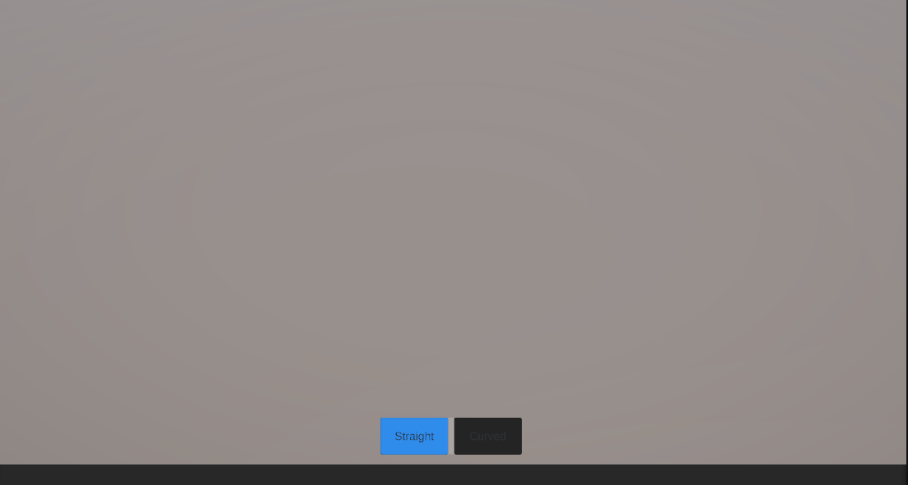
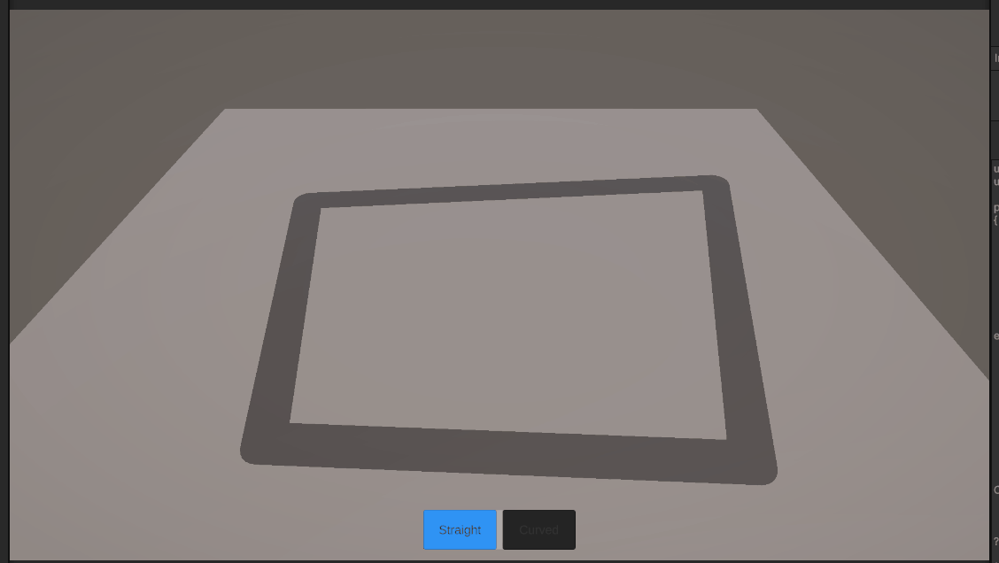
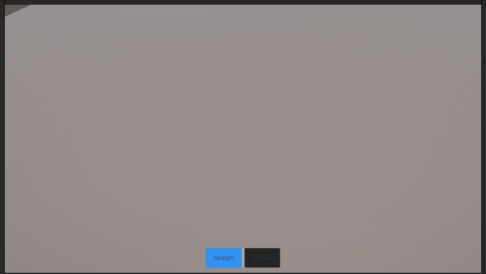
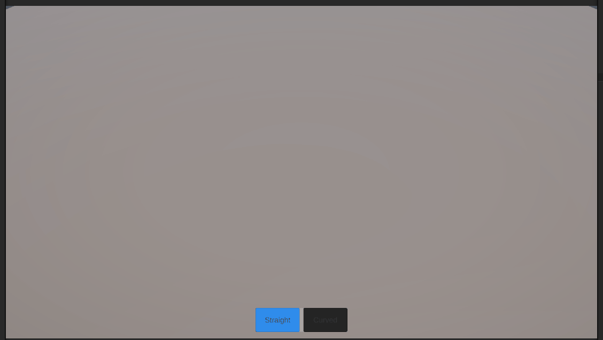
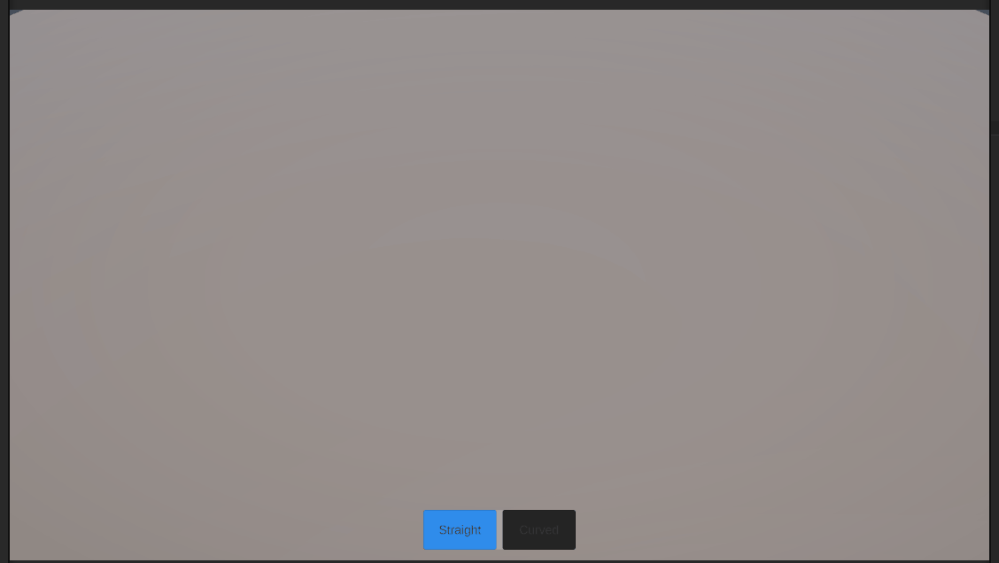

# CityForge 🏙️

A procedural 3D city construction tool for game developers (indie and AAA).  
Build complete cities with roads, zones, and buildings — then export directly into your game engine.

> ⚠️ Early development — features are being added incrementally.

---

## v0.4 — Grid System & Placement Validation

Grid-based snapping system and foundational road placement validation.

### What's new
- Global grid with 1m cell snapping — all road points snap to the nearest meter
- Directional grid visualizer appears while placing roads, showing subsection markers along the road direction
- Grid scales dynamically with the road preview length
- Basic placement validation: blocks roads shorter than 16m and duplicate edges
- Red/green preview feedback — invalid placements shown in red before confirming
- Existing roads highlight red when overlapping with new placement
- Road and junction GameObjects now use a dedicated Road layer for physics queries

### Demo

**Grid snap and directional visualizer**

**Red preview on invalid placement**

**Curves without overlap**

---

## v0.3 — Intersections & Midpoint Snap

Full intersection system with automatic road subdivision and snapping at three points per road segment.

### What's new
- Automatic road intersections (X and T types)
- Roads subdivide at intersection points — no overlaps
- Every road gets a snappable midpoint node automatically
- Curved roads correctly subdivided using de Casteljau algorithm
- Simplified road network architecture (AddCurvedRoad merged into AddRoad)

### Demo

**Roads with snappable midpoint**  

**X intersection**  

**T intersection using midpoint snap**  

---

## v0.2 — Snap & Junctions

Road network now has proper node-based architecture with snapping and junction geometry.

### What's new
- Node-based road network (`RoadNetwork`, `RoadNode`, `RoadEdge`)
- Snap to existing road endpoints with visual indicator
- Automatic junction discs fill gaps between connected roads
- Edges trim correctly at junctions — no overlaps or gaps
- Junctions rebuild dynamically when new roads connect

### Demo

**Snap + junctions**  

---

## v0.1 — Road System

First working version of the road placement system.

### Features
- Straight and curved road drawing
- Bézier-based curve generation
- Procedural mesh generation along the road path
- RTS-style camera (WASD + scroll zoom + middle-click rotation)
- Toolbar UI to switch between road modes

### Demo

**Camera controls**  

**Straight roads**  

**Curved roads**  

---

## Roadmap
- [x] Road placement (straight + curved)
- [x] RTS camera
- [x] Snap to existing nodes
- [x] Snap to curve control points
- [x] Snap to road midpoints
- [x] Road intersections (X and T)
- [ ] Road placement validation (red preview on invalid placement)
- [ ] Lot detection (closed areas become buildable lots)
- [ ] Lot subdivision
- [ ] Zoning system
- [ ] Procedural buildings

---

## Built with
- Unity 6 (6000.3.2f1)
- Unity Splines package

## License
MIT
