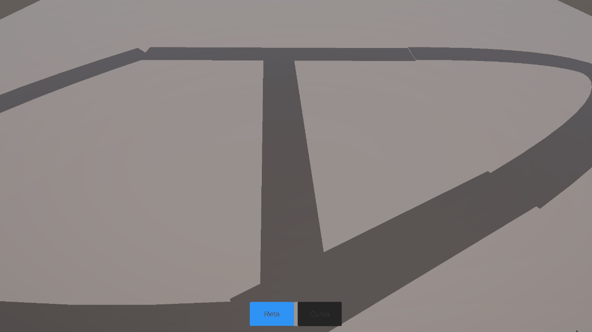
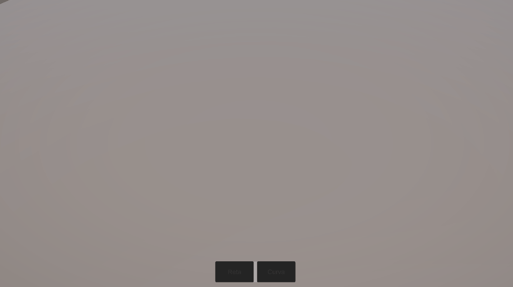
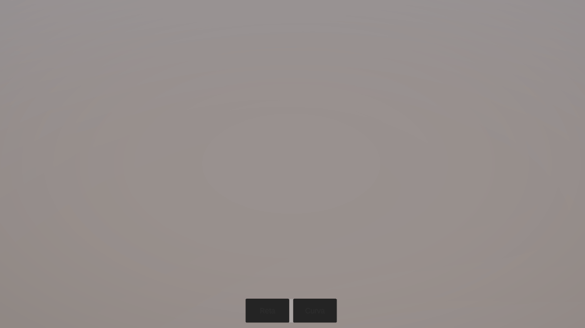

# CityForge 🏙️

A procedural 3D city construction tool for game developers (indie and AAA).  
Build complete cities with roads, zones, and buildings — then export directly into your game engine.

> ⚠️ Early development — features are being added incrementally.

---

## v0.1 — Road System

First working version of the road placement system.

### Features
- Straight and curved road drawing
- Bézier-based curve generation
- Procedural mesh generation along the road path
- RTS-style camera (WASD + scroll zoom + middle-click rotation)
- Toolbar UI to switch between road modes

### Demo

**Camera controls**  

**Straight roads**  

**Curved roads**  

---

## Roadmap
- [x] Road placement (straight + curved)
- [x] RTS camera
- [ ] Snap to existing nodes
- [ ] Road intersections
- [ ] Lot detection
- [ ] Lot subdivision
- [ ] Zoning system
- [ ] Procedural buildings

---

## Built with
- Unity 6 (6000.3.2f1)
- Unity Splines package

## License
MIT
